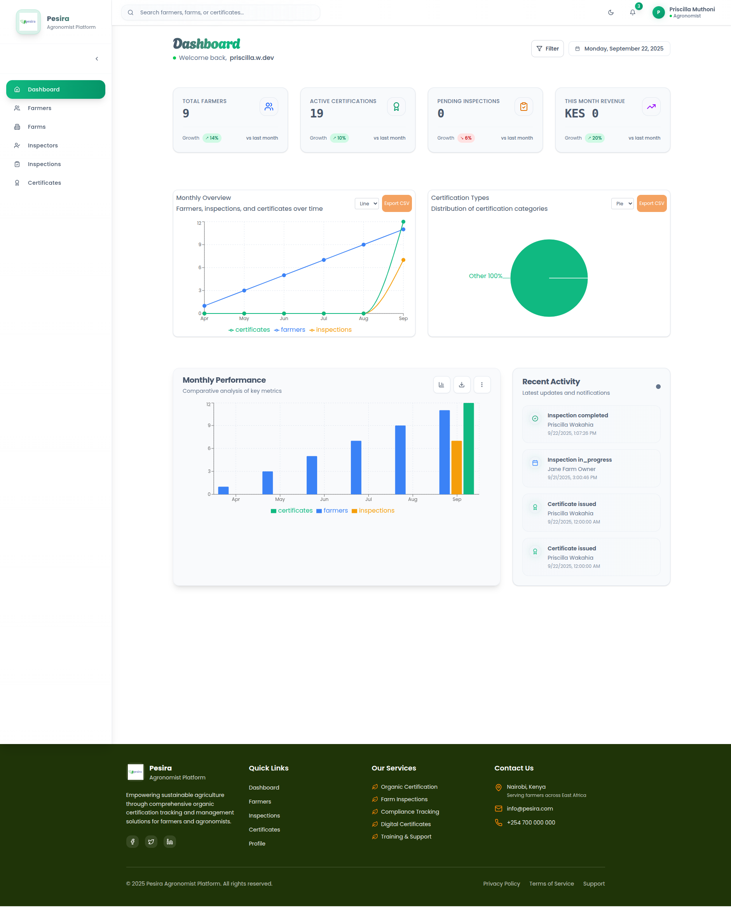
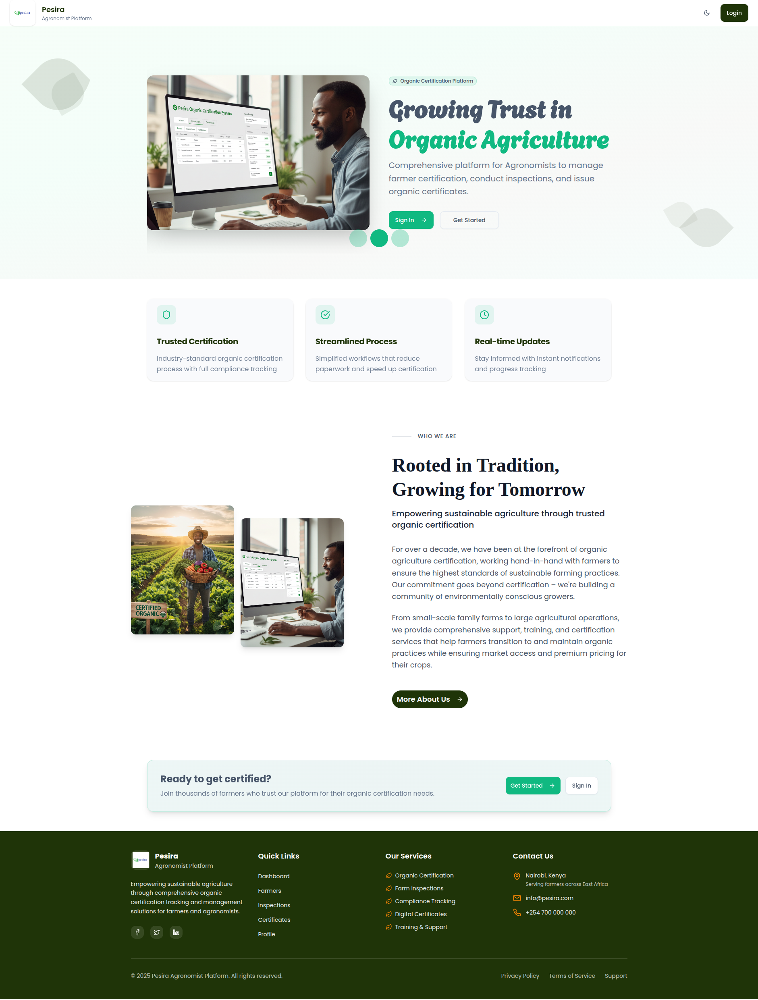
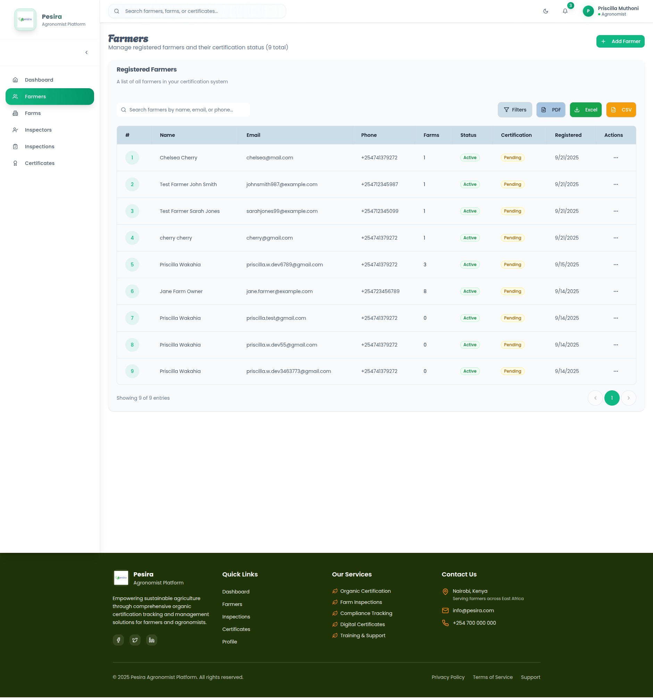

# AgTech Certification Platform - Frontend

A comprehensive web application designed to streamline organic farming certification processes in Kenya. This platform connects farmers, agronomists, and certification administrators in a unified digital ecosystem for managing farm registrations, conducting inspections, and issuing organic certification certificates.

## What This Project Does

The AgTech Certification Platform digitizes the traditional paper-based organic certification process. Farmers can register their farms and track certification progress, agronomists can schedule and conduct digital inspections, and administrators can manage the entire certification pipeline from a centralized dashboard.

Key capabilities include farm profile management, digital inspection workflows, automated certificate generation, and comprehensive analytics for tracking certification trends across different regions and crop types.

## Preview Screenshots

### Main Dashboard


### Farm Management Interface


### Inspection System


## Technology Stack

- **Framework**: Next.js 14 with App Router and TypeScript
- **Styling**: Tailwind CSS with custom design system
- **UI Components**: Radix UI primitives for accessibility
- **Form Management**: React Hook Form with Zod schema validation
- **Authentication**: Firebase Authentication
- **Data Visualization**: Recharts for analytics dashboard
- **PDF Generation**: jsPDF for certificate creation
- **Icons**: Lucide React icon library

## Prerequisites

Before running this project, ensure you have:
- Node.js 18 or higher installed
- npm or yarn package manager
- The backend API server running (see backend repository)
- Firebase project configured for authentication

## Installation & Setup

1. **Clone the repository**
   ```bash
   git clone <repository-url>
   cd agtech-certification-frontend
   ```

2. **Install dependencies**
   ```bash
   npm install
   ```

3. **Environment Configuration**

   Create a `.env.local` file in the root directory:
   ```env
   NEXT_PUBLIC_API_URL=http://localhost:3001/api
   NEXT_PUBLIC_FIREBASE_API_KEY=your_firebase_api_key
   NEXT_PUBLIC_FIREBASE_AUTH_DOMAIN=your_project.firebaseapp.com
   NEXT_PUBLIC_FIREBASE_PROJECT_ID=your_project_id
   NEXT_PUBLIC_FIREBASE_STORAGE_BUCKET=your_project.appspot.com
   NEXT_PUBLIC_FIREBASE_MESSAGING_SENDER_ID=123456789
   NEXT_PUBLIC_FIREBASE_APP_ID=1:123456789:web:abcdef123456
   ```

4. **Start the development server**
   ```bash
   npm run dev
   ```

5. **Access the application**

   Open your browser and navigate to [http://localhost:3000](http://localhost:3000)

## Available Scripts

- `npm run dev` - Starts the development server on port 3000
- `npm run build` - Creates an optimized production build
- `npm run start` - Runs the production server
- `npm run lint` - Runs ESLint to check code quality

## Project Structure

```
agtech-certification-frontend/
├── app/                 # Next.js App Router pages
│   ├── dashboard/      # Dashboard and analytics
│   ├── farmers/        # Farmer management
│   ├── farms/          # Farm registration and management
│   ├── inspections/    # Inspection workflows
│   └── certificates/   # Certificate management
├── components/         # Reusable UI components
├── lib/               # Utility functions and API client
├── hooks/             # Custom React hooks
├── contexts/          # React context providers
└── public/            # Static assets and images
```

## Key Features

- **User Authentication**: Secure login with role-based access control
- **Farm Management**: Complete farm registration with location and crop details
- **Inspection System**: Digital inspection forms with photo documentation
- **Certificate Generation**: Automated PDF certificate creation with official branding
- **Analytics Dashboard**: Real-time statistics and performance metrics
- **Responsive Design**: Mobile-first approach for field use
- **Data Export**: Export capabilities for reports and documentation

## Production Deployment

For production deployment:

1. Set production environment variables
2. Run `npm run build` to create optimized build
3. Deploy to your preferred hosting platform (Vercel, Netlify, etc.)
4. Ensure HTTPS is enabled for Firebase Authentication
5. Configure proper CORS settings for API communication

## Support

For technical support or questions about the platform, please contact the development team or refer to the project documentation.

## License

This project is licensed under the MIT License.